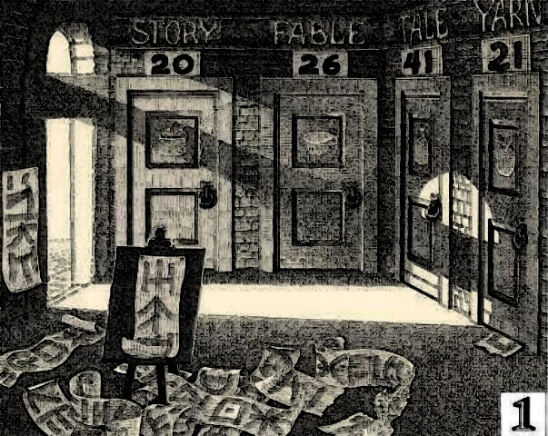
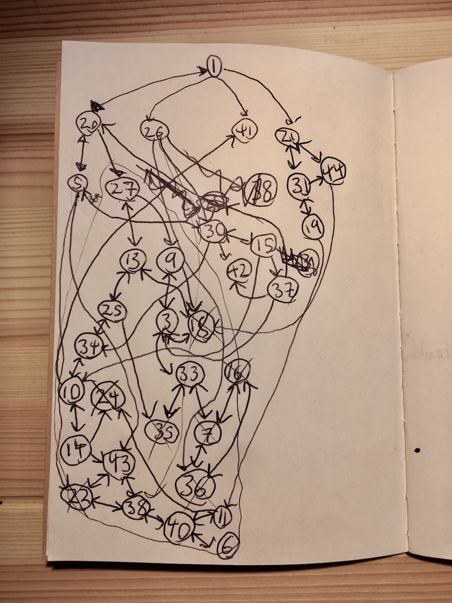
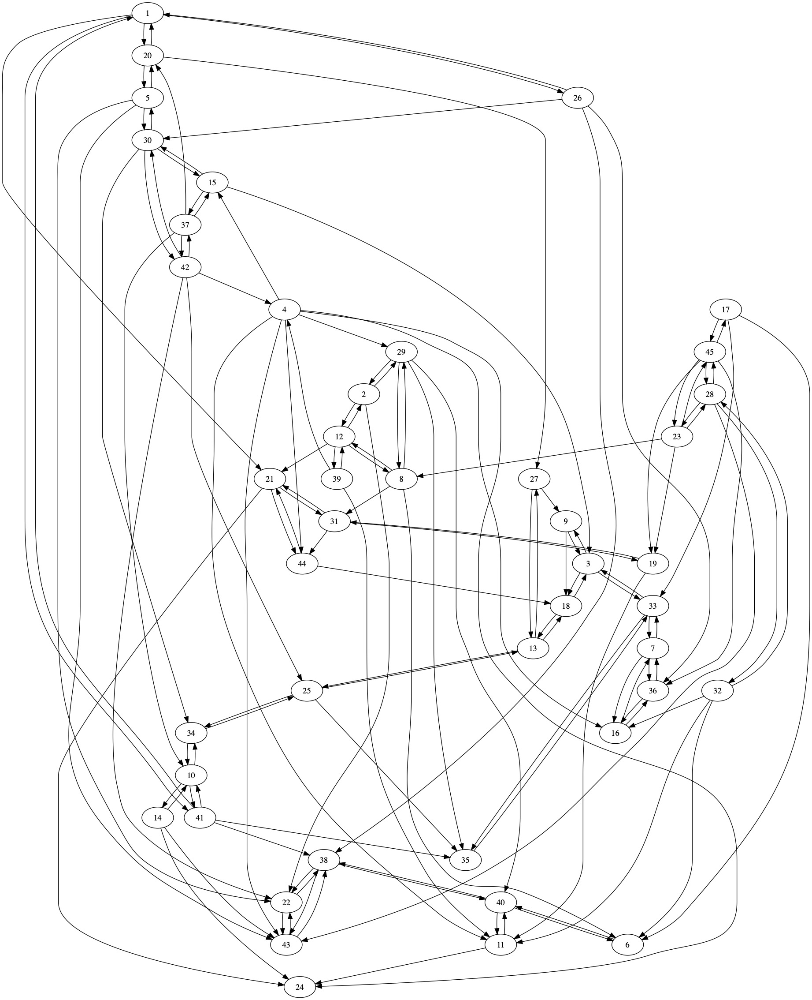
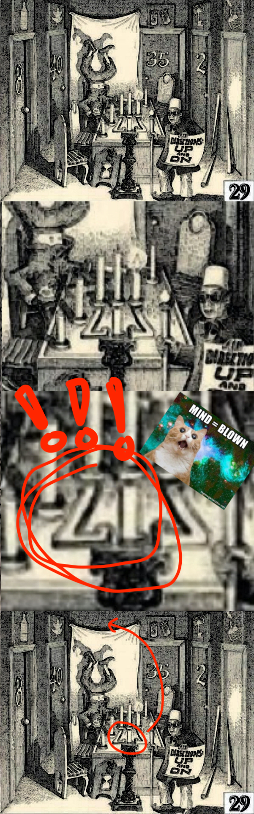

When I was a kid I had a unique and interesting book called *[MAZE:
Solve the World's Most Challenging
Puzzle](https://en.wikipedia.org/wiki/MAZE:_Solve_the_World%27s_Most_Challenging_Puzzle)*. I
recently solved the puzzle (or at least the first, easiest part of it)
by writing a program. I thought that applying programming to it would
rob the book of some of its magic, but it actually made it feel more
magical! Read on to find out how.

The book itself is nonlinear—sort of like the
choose-your-own-adventure books that were also popular when I was a
kid. Each page has an illustration depicting a room in the titular
maze, and containing numbered doors that you can use to go to other
rooms/pages. For example, here's room 1, the entrance to the maze:



To take the door to room 20, you simply turn to page 20, which will
also have numbered doors in it. By doing this repeatedly, you
"navigate" through the maze. To get a feel for what it's like, you can
explore an online version of the book
[here](http://www.intotheabyss.net/room-1/#post-4).

The goal is to find your way from room 1 to the room at the center of
the maze (room 45) and back in only sixteen steps (this is the easy
part of the puzzle, which I solved). Then, once you've done that,
answer the riddle hidden in the illustration of room 45, using the
clues hidden along the path there and back (this is the hard part,
which no one has solved yet).

In addition to the central puzzle, the eerie, painstakingly crafted
woodcut illustrations and sparse but evocative descriptions of each
room are also delightful in their own right. The book is full of
allusions to fables and fairytales, gothic architecture, furtive
clues, and mysterious symbolism. Reading (playing?) it feels like
stepping into a Hans Christian Anderson story or a Guillermo del Toro
movie.

My childhood copy was lost long ago, but a couple of very kind friends
got me another as a gift after I mentioned it to them. I never solved
the maze as a kid, and I was excited to try as an adult!

---

I started out by just wandering among the rooms more or less at
random, basking in nostalgia. This was fun, but I quickly realized I
was never going to solve the maze this way.

I moved on to trying to "map" the maze using a pen and paper. As I
explored, I kept track of where I'd been by drawing circles for rooms
and lines between them for doors, building a graph of the maze in the
process:



As you can see, this got messy fast. It was still useful though,
because it led me to the surprising conclusion that room 45 is
unreachable from room 1! I was fairly confident I had mapped out every
possible path, and as you can see in the picture, room 45 is nowhere
to be found.

I was flummoxed. A natural next step would have been to turn to
computers, since a graph search algorithm could tell me very quickly
if I was right. But I felt that his would be cheating somehow—like it
would rob the book of some of it's magic. My friend
[Rachel](http://rahwang.mystrikingly.com/) eventually convinced me
that was silly, and she was right! I decided to write some programs to
help me out.

The first thing I did was to go through the book one page at a time
and transcribe all the connections between rooms into a graph written
in the [DOT graph description
language](https://en.wikipedia.org/wiki/DOT_(graph_description_language)). It
looked something like this[^1]:

```dot
digraph maze{
        1 -> 20;
        1 -> 26;
        1 -> 41;
        1 -> 21;
        2 -> 29;
        ...
}
```

DOT files can be parsed by all sorts of graph processing and
visualization tools, so representing the maze this way is a good
starting point. `digraph` means that the edges in this graph have a
direction (i.e. just because you can go from room X to room Y doesn't
mean you can go from Y back to X). The line `1 -> 20;` means that you
can reach room 20 from room 1, and so on.

Next, I used `graphviz` to draw a picture of the graph:





Not much better than my hand-drawn map, but it is a nice visualization
of some things about the structure of the maze that you feel
intuitively while playing it. For example, that there are "clusters"
of three rooms that form tight loops with each other (e.g. 7-36-16, or
38-22-43).

Next, I wanted to confirm my suspicion that room 45 is not reachable
from room 1. To do this, I used
[NetworkX](https://networkx.github.io/):


```python
import networkx as nx
import pydot

g = nx.drawing.nx_pydot.read_dot("maze.dot")
nx.shortest_path(g, "1", "45")
```

This throws an error: `NetworkXNoPath: No path between 1 and 45.` So
indeed, no such path exists! What could be going on?

It dawned on me that there must be a "hidden door" somewhere in the
maze, connecting two rooms that don't at first appear to be connected,
and discoverable only by careful examination of the
illustrations. This was already really cool and made the book feel
more magical! I'd never suspected that it had something like this in
it, and I never would have figured it out if a graph search algorithm
hadn't convinced me it must be true.

Next, I wrote a small program that helped me find the hidden
door. **Spoiler warning: stop reading here if you'd like to try to
figure it out on your own.**

---

OK, how to find the the hidden door? Well, we know from the book's
marketing copy that the path from the beginning to the end of the maze
and back has exactly sixteen steps. We can also see that while there
doesn't seem to be a path from the beginning to the end, there is a
path back, and it's nine steps long:

```pycon
>>> nx.shortest_path(g, "45", "1")
['45', '23', '8', '12', '39', '4', '15', '37', '20', '1']
```

 This means the path there is seven steps long[^2].

 We can also see from looking at the DOT file (or just flipping
 through the pages of the book) that there are only three rooms that
 have doors leading to room 45: 17, 23, and 28. This means the hidden
 door must either lead into one of these rooms, or lead into room 45
 directly[^3].

 All of this suggests an algorithm for finding the hidden
 door:

 1. Consider all possible edges that could be added to the graph,
    and which lead to room 17, 23, 28, or 45.
 2. For each such edge, add it to the graph, then try to find the
    shortest path from room 1 to 45. If there is such a path and it's
    seven steps long, this edge could represent the hidden door.

In Python code, this looks like:


```python
for e in nx.non_edges(g):
    if e[1] not in ["17", "23", "28", "45"]:
        continue
    g.add_edge(*e)
    try:
        path = nx.shortest_path(g, "1", "45")
        if len(path)-1 == 7:
            print(e)
    except:
        pass
    g.remove_edge(*e)
```

Running it prints all the candidate edges:

```
('2', '45')
('29', '17')
('29', '23')
('29', '28')
('8', '45')
```

NetworkX represents edges as tuples, so `('2', '45')` means an edge
from node 2 to node 45 (i.e. a door from room 2 to room 45).

This is a small enough list of candidates that we can just look at the
illustrations of rooms 2, 8, and 29 by hand to see which one might
have the hidden door in it! Rooms 2 and 8 aren't very interesting but
let's look closely at room 29, looking for a hidden door into room 17,
23, or 28:



Aha! There's a door to room 17 hidden behind the curtain, the
characters in this room just took off the sign for it, turned it
upside down, and used it as a candelabra!

In hindsight, there are lots of clues in this room that point to
this. For instance, one of the characters is upside down, indicating
we're looking for something upside down. Also, the sign reading
"Directions: Up And On" could indicate that we need to turn something
right-side up in order to move on.

Adding this edge to the graph gives us the complete path through the
maze:

```pycon
>>> g.add_edge("29", "17")
>>> nx.shortest_path(g, "1", "45") + nx.shortest_path(g, "45", "1")
['1', '26', '30', '42', '4', '29', '17', '45', '45', '23', '8', '12',
'39', '4', '15', '37', '20', '1']
```

There and back again in sixteen steps! You can follow this path
yourself in the book or
[online](http://www.intotheabyss.net/room-1/#post-4)
to verify that it's correct.

---

I was pleasantly surprised that using a computer to solve the puzzle
actually *added* the magical aura of the book for me, rather than
taking away from it. The presence of the hidden door is so charming,
and I probably never would have discovered it without writing a
program to help me.

Anyway, the title of this post is sort of clickbait. I did use Python
to find the path through the maze, but that's far from "the world's
hardest puzzle".  When the book was first published in 1985, the
hidden door and the path through the maze were discovered quickly. The
"world's hardest puzzle" part is finding and answering the riddle
hidden in the illustrations, which still to this day no one has done!

If you want to learn more about the book and see all the work that its
small but dedicated community of fans has put into solving it, check
out [Into the Abyss](http://www.intotheabyss.net/), a delightful
website lovingly maintained by a devotee known only as "White
Raven". It has extensive documentation, lore, and discussion about
MAZE, and people still post on it regularly with new ideas and
theories about how to decipher the book's mysteries.

You can find a Jupyter notebook containing the code from this post, as
well as the DOT file representing the maze
[here](https://github.com/porterjamesj/maze).


[^1]: You can download the full DOT file, representing the entire
      maze,
      [here](https://raw.githubusercontent.com/porterjamesj/maze/master/maze.dot).
[^2]: This isn't necessarily true, in that the hidden door could
      somehow create a path to the end and a new path back, but that
      just seemed unlikely so I decided to run with the assumption
      that hidden door only created the forward path, leaving the path
      back unchanged.
[^3]: You might be thinking "wait, couldn't it also connect two rooms
      elsewhere in the maze that somehow create a path to room
      45?". It can't, since any such path would have to go through
      room 17, 23, or 28—but we know these rooms aren't reachable from
      room 1, since if they were, there would already be a path to the
      end! The only way for them to become reachable is if the hidden
      door leads to one of them.
